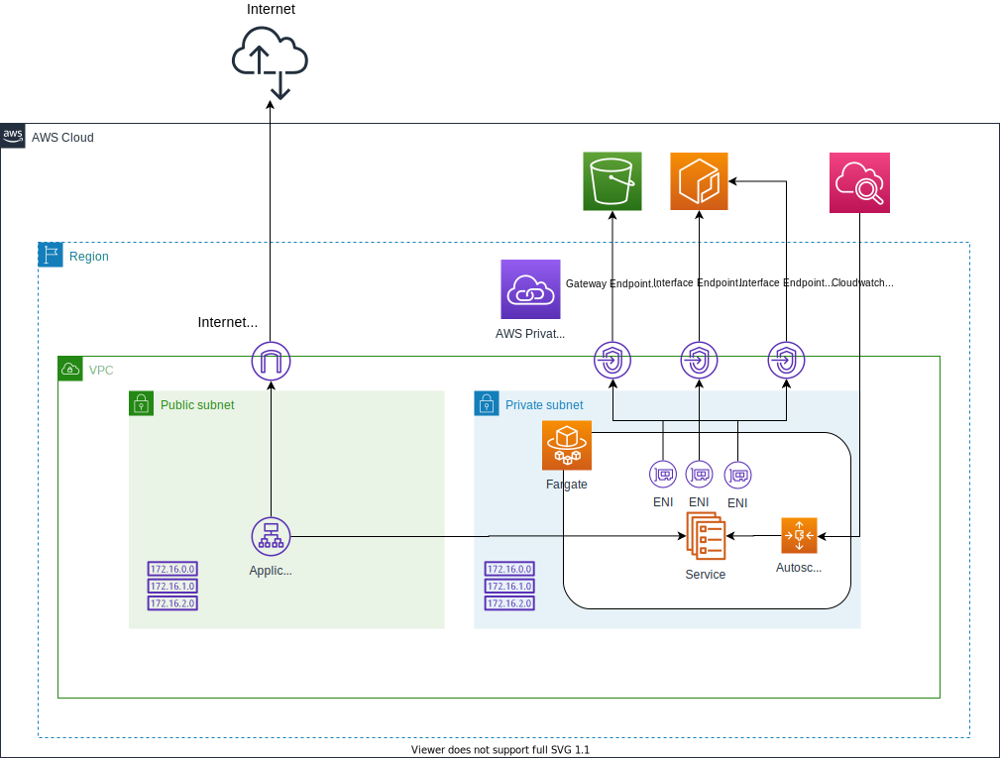

# Introduction

The primary output from this demo is to initially deploy a two web servers powered by NGINX via an Application Load Balancer, scaling to multiple instances based on auto scaling policies. The demo uses Target Tracking scaling policies to simplify the creation of auto scaling but after refactoring the module structure in future it will allow more flexibility in providing Step Scaling policies as well, which provides more granularity and control to the user.

You can use your own Dockerfile that will be used as input to the build, push and provision. 

I'm using [Fargate](https://aws.amazon.com/fargate) which is a serverless compute engine.

In my case the instances only used a NAT Gateway in order to pull Docker images from ECR and therefore I moved to a more optimal approach using [VPC Endpoints](https://docs.aws.amazon.com/AmazonECR/latest/userguide/vpc-endpoints.html) removing the additional complexity and cost of a NAT Gateway.

- Creation of Core Network - ALB, VPC, VPC Endpoints, Internet GW, Route Tables (RT), Routes, RT Association and Subnets
- Creation of Security - Security Groups, IAM Policies
- Creation of [Elastic Container Registry](https://aws.amazon.com/ecr/)
- Image build and push to ECR 
- Creation of [Elastic Container Service](https://aws.amazon.com/ecs/) Cluster 
- Creation of [ECS Task](https://docs.aws.amazon.com/AmazonECS/latest/developerguide/task_definitions.html)
- Creation of [ECS Service](https://docs.aws.amazon.com/AmazonECS/latest/developerguide/ecs_services.html) 



## Pre-requisites

You will need to ensure your credentials are reachable in order to authenticate with AWS see this link
[AWS Provider Authentication Options](https://registry.terraform.io/providers/hashicorp/aws/latest/docs)

As we automate the process to log into the AWS Private Registry, build the image and push it, you will need [Docker](https://docs.docker.com/get-docker/) installed.

Install [AWS CLI](https://docs.aws.amazon.com/cli/latest/userguide/install-cliv2.html) as we need to log into the Registry in order to push our newly built image.

First run aws configure and enter **YOUR** values

```bash
$ aws configure
AWS Access Key ID [None]: accesskey
AWS Secret Access Key [None]: secretkey
Default region name [None]: us-west-2
Default output format [None]:
```

Now when running Terraform Apply later this command will successfully login to your repository

```bash
aws ecr get-login-password --region "$region" | docker login --username AWS --password-stdin "$repository_url" 
```

## Usage

Navigate to the cloned repository locally on your device. A *webapp.tfvars* file has been provided as a base to update/amend values as you please. No data held in this [tfvars](https://www.terraform.io/docs/language/values/variables.html) file is sensitive but always exercise caution when storing these types of files on public reposititories as sensitive values can be present even by accident.

A few entries you may want to change:

**ecs_service_desired_count:** when you provision your service, you can state how many tasks to create from the beginning. Note: once the service is deployed, Terraform will no longer track any changes to *Desired Count* given that the count will likely change through scaling and therefore a [Lifecycle Block](https://www.terraform.io/docs/language/meta-arguments/lifecycle.html) exists in the code.

**ecr_build_path:** a relative path to your image
**ecr_image:** a name for your image
**ecr_image_tag:** a tag for said image

**aws_appautoscaling_target_min_capacity:** The target minimum tasks for your service
**aws_appautoscaling_target_max_capacity:** The target maximum tasks for your service
**target_policy_mem_target_value:** A value for the percentage target for memory usage
**target_policy_cpu_target_value:** A value for the percentage target for cpu usage

Outside of these values you can scale manually in the ECS Service UI

Once happy with the inputs, you may execute

[Terraform Init](https://www.terraform.io/docs/cli/commands/init.html)

```bash
terraform init
```
[Terraform Plan](https://www.terraform.io/docs/cli/commands/plan.html)

```bash
terraform plan -var-file=webapp.tfvars -out=path<ADD YOUR TARGET>
```

If the result is what you expected, feel free to

[Terraform Apply](https://www.terraform.io/docs/cli/commands/apply.html)

```bash
terraform apply -auto-approve -var-file=webapp.tfvars <YOUR PLAN NAME AS ABOVE>
```

Note when you [Terraform Destroy](https://www.terraform.io/docs/cli/commands/destroy.html) you'll need to provide that tfvar file as input again.

## Providers

[AWS](https://registry.terraform.io/providers/hashicorp/aws/latest/docs)\
[NULL](https://registry.terraform.io/providers/hashicorp/null/latest)

## In Progress

- [x] Add ALB functionality
- [x] Replace NAT GW with VPC Endpoints
- [] Move state to S3 with Dynamo providing the locking
- [] Add switch functionality to turn on/off certain modules
- [] Move modules to own repositories
- [] Create more flexibility in data structure to process more objects i.e. for_each
- [] Split the existing Root module and create more state seperation together with wrapper script for executing commands with good user experience
- [] Add workspaces
- [] Enrich the current modules with the additional functionality provided by the Provider
- [] Add Terratest tests

## Contributing
Pull requests are welcome. For major changes, please open an issue first to discuss what you would like to change.

## License
[MIT](https://choosealicense.com/licenses/mit/)
